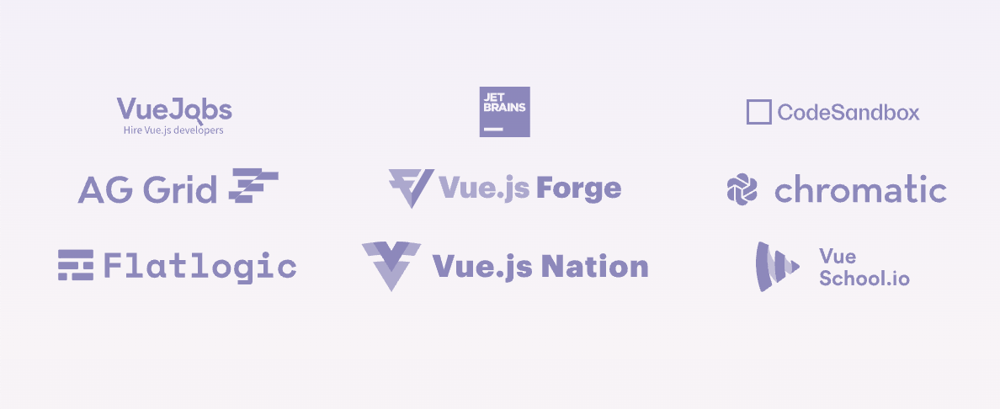

<p align="center">
  <a href="https://Vuestic.dev" target="_blank">
    
  </a>
</p>

<p align="center">
  Vue 3、Vite、Pinia、およびTailwind CSS を利用した無料で美しい管理テンプレート。効率的でレスポンシブ、かつ高速な管理インターフェースの構築に最適です。</br>
  開発者: <a href="https://epicmax.co">Epicmax</a>。</br>
  <a href="https://ui.Vuestic.dev">Vuestic UI</a> ライブラリをベースにしています。
</p>

<p align="center">
  <a href="https://admin-demo.Vuestic.dev"> ライブデモ </a> |
  <a href="https://admin-landing.Vuestic.dev/"> Vuestic Admin について </a> |
  <a href="https://ui.Vuestic.dev/">Vuestic UI ドキュメンテーション</a>
</p>

> Vuestic Admin は [Vuestic UI](https://ui.Vuestic.dev) で構築されています。私たちの
> <a href="https://github.com/epicmaxco/Vuestic-ui/issues">課題</a>、
> <a href="https://ui.Vuestic.dev/en/contribution/guide">貢献ガイド</a> を参照して、
> <a href="https://discord.gg/jTKTjj2weV">Discord サーバー</a> でディスカッションに参加して、Vuestic Admin ＆ Vuestic UI の体験を向上させるのに役立ててください。

<p align="center">
  <a href="https://admin.Vuestic.dev" target="_blank">
    
  </a>
</p>

### クイックスタート

次のコマンドを使用して、[Vuestic Admin](admin-demo.Vuestic.ui) または空の Vite または Nuxt プロジェクトを [Vuestic UI](ui.Vuestic.dev) と共に素早く構築します。

```bash
npm create Vuestic@latest
```

[Vuestic Admin](admin.Vuestic.ui) をインストールしたら、`npm install` を実行して依存関係をインストールし、次に `npm run dev` を実行してローカル開発サーバーを起動します。

### ドキュメンテーション

ドキュメンテーション、ガイド、例、およびチュートリアルは [ui.Vuestic.dev](https://ui.Vuestic.dev) で利用可能です。

### 公式 Discord サーバー

公式コミュニティの [Discord サーバー](https://discord.gg/jTKTjj2weV) で質問してください。

### 特徴

- **Vue 3、Vite、Pinia、および Tailwind CSS -** 高速かつ効率的な開発
- **ダークテーマ -** モダンで目を引く
- **グローバル構成 -** 無駄なくカスタマイズ可能
- **アクセシビリティ -** 包括的でユーザーフレンドリー
- **i18n 統合 -** グローバルな展開のための簡単なローカリゼーション
- **教育リソース -** 学習とスキル向上に最適
- **レスポンシブデザイン -** すべてのデバイスにシームレスに適応
- **プロフェッショナルサポート -** 専門家からの信頼性のあるサポート
- **高度にカスタマイズ可能 -** プロジェクトのスタイルに合わせて調整

### 貢献

素晴らしい PR、課題、アイデアに感謝します。

<a href="https://github.com/epicmaxco/Vuestic-admin/graphs/contributors">

</a>
<br>

いつでも参加歓迎です：私たちの
<a href="https://ui.Vuestic.dev/en/contribution/guide">
貢献ガイド</a>
、 [オープン課題](https://github.com/epicmaxco/Vuestic-ui/issues)
および [Discord サーバー](https://discord.gg/jTKTjj2weV) を確認してください。

### パートナー & スポンサー ❤️



パートナーになる: [hello@epicmax.co](mailto:hello@epicmax.co)

### お仕事の依頼はできますか？

[Epicmax](https://epicmax.co) は初めからオープンソースにコミットしています。Vuestic Admin は Epicmax によって作成され、そしてこれまでのすべての年月を通じてサポートされています。

6年以上にわたる商業およびオープンソースプロジェクトへの専念した作業、および世界中のさまざまな分野で47以上のクライアントを持つことで、Epicmaxは特にVue.jsにおけるフロントエンド開発の深い専門知識を有しています。私たちはプロジェクトのコード監査を定期的に実施しており、これまでのクライアントだけでなく、フロントエンドコードの状態を理解し、セキュアで最新であることを確認したいすべての方にこのサービスを提供することに興奮しています！

Epicmaxによるウェブ開発サービスの相談や注文は、この[フォーム](https://epicmax.co/contacts)からリクエストできます 😎

こんにちはと言いたい方は: [hello@epicmax.co](mailto:hello@epicmax.co)。一緒に仕事ができることを嬉しく思います！

[これまでの仕事](https://epicmax.co) 🤘

[チームに会う](https://ui.Vuestic.dev/introduction/team)

### 受賞歴

[](https://flatlogic.com/templates/Vuestic-vue-free-admin)

<p>
  [Flatlogic](https://flatlogic.com/templates/Vuestic-vue-free-admin) マーケットプレイスによる
</p>

### 私たちをフォローしてください

最新のVuesticニュースをお知らせします！
[Twitter](https://twitter.com/Vuestic_ui) または [Linkedin](https://www.linkedin.com/company/18509340) でフォローしてください。

### ライセンス

[MIT](https://github.com/epicmaxco/Vuestic-admin/blob/master/LICENSE) ライセンス。
